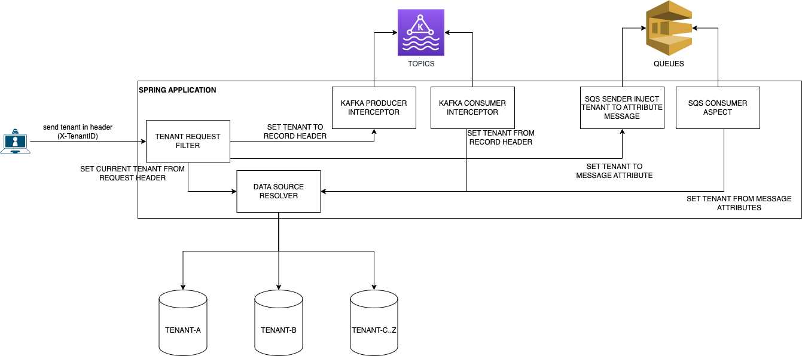

# Spring Boot Multi Tenant By Data Base
The goal of this application is resolve multi tenant segregating data in different databases,
and propagate the tenant information in requests and messages using Kafka and SQS

### Solutions Architecture


### Docker
In the docker-compose file there is all that you need to run in local environment.
```
docker-compose up -d
```
this command will start
<ul>
    <li>postgres</li>
    <li>kafka</li>
    <li>kafdrop</li>
    <li>localstack</li>
</ul>

### AWS Local Stack
Install awscli-local
```
pip3 install awscli-local
```

List queues
```
awslocal sqs list-queues
```

Send message
```
awslocal sqs send-message \
 --queue-url http://localhost:4566/000000000000/confirmation-by-mail-requested \
 --message-body file://docker/localstack/message/confirmation-by-mail-requested/body.json \
 --message-attributes file://docker/localstack/message/confirmation-by-mail-requested/attributes.json
```