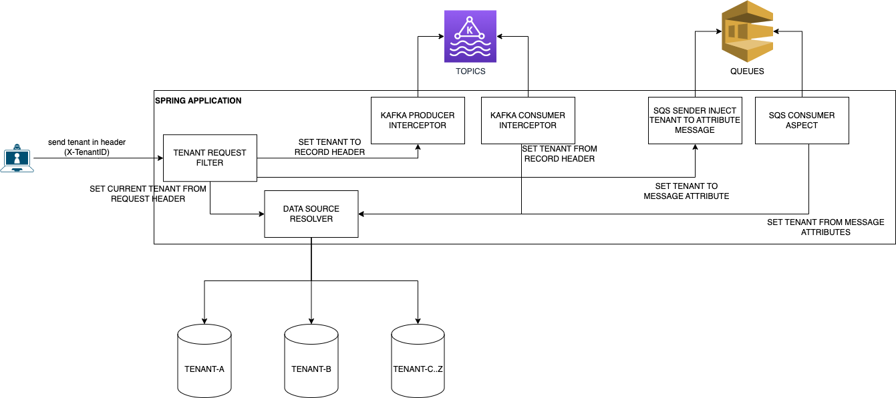

# Spring Boot Multi Tenant By Data Base
The goal of this application is resolve multi tenant segregating data in different databases,
and propagate the tenant information in requests and messages using Kafka and SQS

### Solutions Architecture


### Use case sequence of this demo application


### Docker
In the docker-compose file there is all that you need to run in local environment.
```
docker-compose up -d
```
this command will start
<ul>
    <li>postgres</li>
    <li>kafka</li>
    <li>kafdrop</li>
    <li>localstack</li>
</ul>

### Postman Collection
#### You can find postman collection
[here](documentation/multi-tenant.postman_collection.json)
in this file there are three requests
<ul>
    <li>[GET] - /home/tenants - show the tenants configuration</li>
    <li>[GET] - /customer/{id} - get customer by id</li>
    <li>[POST] - /customer - create customer</li>
</ul>

To execute the use case showed in sequence diagram use the POST request

### AWS Local Stack
#### optional steps - only necessary if you want to send message to sqs by command line
Install awscli-local
```
pip3 install awscli-local
```

List queues
```
awslocal sqs list-queues
```

Send message
```
awslocal sqs send-message \
 --queue-url http://localhost:4566/000000000000/confirmation-by-mail-requested \
 --message-body file://docker/localstack/message/confirmation-by-mail-requested/body.json \
 --message-attributes file://docker/localstack/message/confirmation-by-mail-requested/attributes.json
```

### Documentation
#### All documentation resources is [here](documentation)

Used tools to create diagrams (exported images are editable):  
https://app.diagrams.net/  
https://sequencediagram.org/